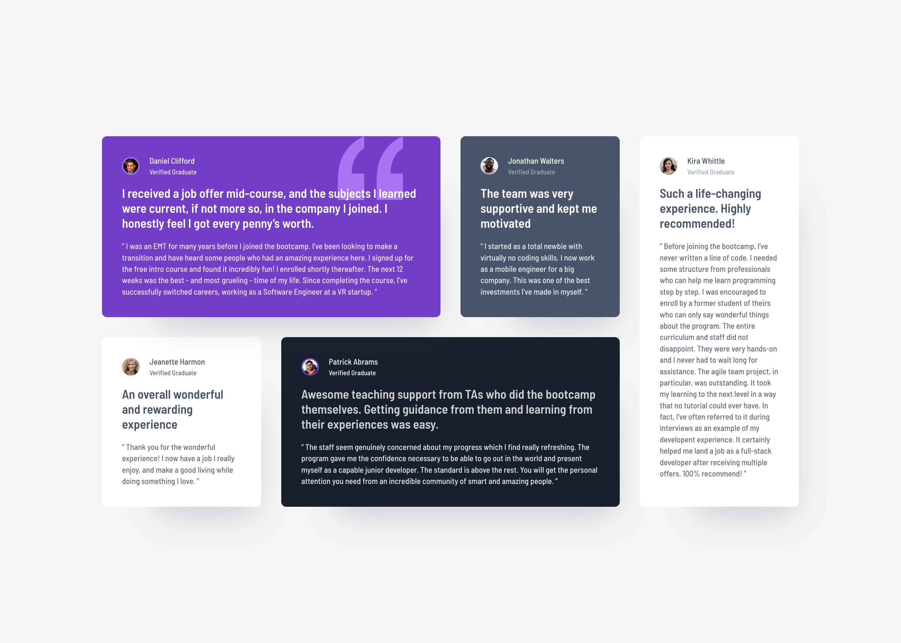
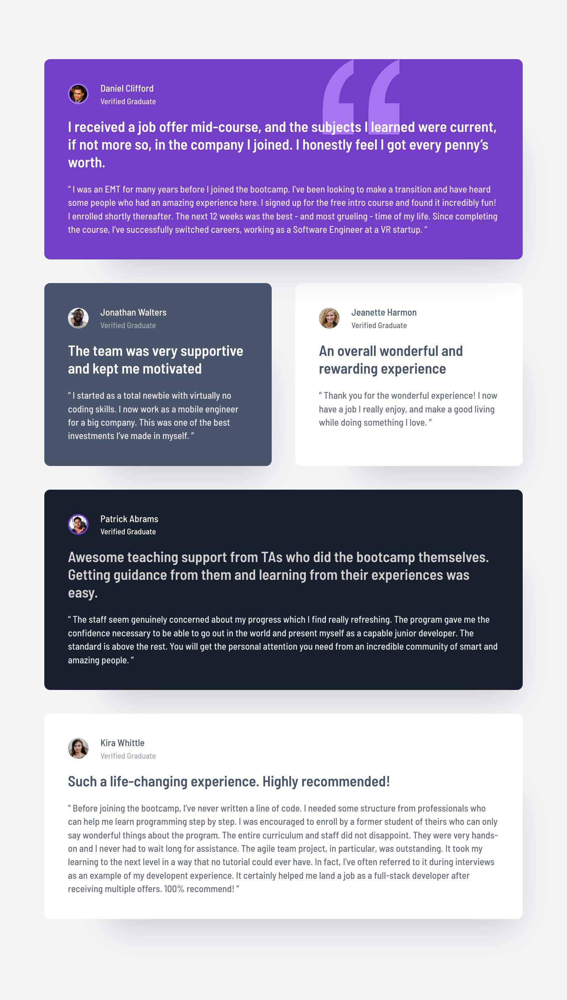

# Frontend Mentor - Testimonials grid section solution

This is a solution to the [Testimonials grid section challenge on Frontend Mentor](https://www.frontendmentor.io/challenges/testimonials-grid-section-Nnw6J7Un7). Frontend Mentor challenges help you improve your coding skills by building realistic projects. 

## Table of contents

- [Overview](#overview)
  - [The challenge](#the-challenge)
  - [Screenshot](#screenshot)
  - [Links](#links)
- [My process](#my-process)
  - [Built with](#built-with)
  - [What I learned](#what-i-learned)
  - [Continued development](#continued-development)
- [Author](#author)

## Overview

### The challenge

Users should be able to:

- View the optimal layout for the site depending on their device's screen size

### Screenshot

#### Desktop


#### Tablet


#### Mobile


### Links

- Solution URL: [](https://www.frontendmentor.io/solutions/testimonials-grid-section-semantic-html-mobile-first-css-Wsz2UMX7rn)
- Live Site URL: [](https://iddahadev.github.io/frontend-mentor-testimonials-grid-section/)

## My process

### Built with

- Semantic HTML5 markup
- CSS custom properties
- Flexbox
- CSS Grid
- Mobile-first workflow

### What I learned

#### CSS Grid: explicit rows with `auto`

At first, I used `repeat(2, 1fr)` but it made the second row bigger.

```css
.testimonial-wrapper {
    grid-template-rows: repeat(2, auto);
}
```

#### Pseudo-elements for decorative images

Instead of having an `img` tag that had no purpose, I used this pseudo-element.

```css
.testimonial:first-child::after {
    content: "";
    position: absolute;
    width: 104px;
    height: 102px;
    background-image: url('../../images/bg-pattern-quotation.svg');
    background-repeat: no-repeat;
    background-size: contain;
}
```

### Continued development

I want to focus on better CSS authoring by leveraging new/modern syntaxes.

## Author

- Github - [@iddahadev](https://github.com/iddahadev)
- Frontend Mentor - [@iddahadev](https://www.frontendmentor.io/profile/iddahadev)
